# Proyecto Individual N° 2: Data Analyst (DA)

Resolución del segundo proyecto individual del BootCamp Data Science (dataft21) de Soy Henry

## Introducción

En Buenos Aires, los accidentes de tráfico son una preocupación diaria que involucra a todos los usuarios de la vía, con consecuencias que van desde daños materiales hasta lesiones mortales. La densidad de tráfico y poblacional exacerba el riesgo, impactando la seguridad pública y la infraestructura. Las tasas de mortalidad por accidentes viales, un indicador clave de la seguridad vial, reflejan la urgencia de reducir estos incidentes para salvar vidas. Anualmente, los siniestros viales son la principal causa de muertes violentas en Argentina, con aproximadamente 4,000 fallecimientos y una tendencia que supera las muertes por delitos.

Este proyecto tiene como objetivo principal analizar la información relacionada con los fallecimientos en accidentes de tráfico en Buenos Aires durante el periodo 2016-2021. La finalidad es producir datos y conclusiones relevantes que sirvan a las autoridades para establecer estrategias que reduzcan eficientemente el número de muertes y lesionados en dichos incidentes.

## Metodología y herramientas

El proyecto se desarrolló siguiendo estos pasos:

1. **Recopilación de Datos**: Se recolectaron datos de la Secretaría de Transporte de Buenos Aires, que incluían detalles sobre lesiones y homicidios en accidentes viales.

2. **Limpieza y preprocesamiento de Datos (ETL)**: Se organizó y limpió la información utilizando herramientas como Numpy y Pandas.

3. **Análisis Exploratorio de Datos (EDA)**: Se realizó un análisis preliminar para identificar patrones y obtener insights sobre los homicidios en accidentes de tráfico.

4. **Revisión del progreso de los objetivos estratégicos (KPI)**: Se analizó los resultados de 3 indicadores de progreso sobre objetivos estratégicos previamente decididos

Se utilizó las siguientes herramientas (Stack tecnológico):

&nbsp; &nbsp; &nbsp;      

## Estructura del repositorio

- Carpeta Datasets: Donde se encuentran los archivos originales sin modificación que se usaron en el proyecto
- Carpeta Imágenes: Donde se encuentran imágenes para mostrar en este readme.md y el dashboard.pbix
- Carpeta Notebooks: Donde se encuentran los notebooks de trabajo preliminar de ETL, EDA y KPis
- Carpeta Shapefile: Donde se encuentran los archivos geoespaciales ESRI Shapefile y TopoJSON para visualizaciones de mapas
- Archivo .gitigonre: Archivo para establecer las carpetas y archivos que no serán revisados por el sistema Git
- Archivo Dashboard.pbix:  Dashboard Power BI con tableros resúmenes interactivos de lo más resaltante del proyecto de análisis de datos
- Archivo environment.yml: Archivo de configuración Anaconda para crear un enviroment con todas las dependencias/librerias necesarias para este proyecto (conda env create -f environment.yml) 
- Archivo Notas.md: Simples notas del autor
- Archivo README.md: Este archivo

## Desarrollo

En el proyecto se utilizó la **Base de Datos de Víctimas Fatales en Accidentes de Tráfico**, en el que se usaros los datasets de homicidios y lesiones (archivos de Excel) con dos secciones principales:

- **HECHOS**: Incluye un registro por cada evento con un identificador único y datos sobre el tiempo, lugar e involucrados.

- **VÍCTIMAS**: Presenta un registro por cada persona afectada, detallando su edad, género y medio de transporte, y se relaciona con los HECHOS a través del identificador del evento.

En el [documento](Orig/NOTAS_HOMICIDIOS_SINIESTRO_VIAL.pdf) se explican las definiciones usadas en los datos y en el proyecto. Además, los datos empleados están disponibles en este [enlace](https://data.buenosaires.gob.ar/dataset/victimas-siniestros-viales).

Para el **Proceso de ETL (Extracción, Transformación y Carga)**, se extrajeron y limpiaron los datos de los conjuntos `HECHOS` y `VÍCTIMAS` usando Numpy y Pandas en Notebooks de Visual Studio Code. Se eliminaron valores nulos y duplicados, se realizaron cambios en los tipos de datos, se descartaron columnas innecesarias y se combinaron las tablas en un solo archivo [siniestros_limpio.csv](Datasets/siniestros.csv). Revisar código ETL en [01_ETL.ipynb](Notebooks/01_ETL.ipynb)

Durante el **Proceso de EDA (Análisis Exploratorio de Datos)**, se analizaron las relaciones entre las variables numéricas y categóricas de los conjuntos de datos limpios, se identificaron posibles anomalías y se buscaron patrones útiles para análisis futuros. Revisar código EDA en [02_EDA.ipynb](Notebooks/02_EDA.ipynb)

Luego el **Proceso de KPI (Indicador Clave de Desempeño)**, que sigue del Análisis Exploratorio de Datos, se utiliza los dataset resultantes [homicidios_limpio.csv](Datasets/homicidios_limpio.csv), [lesiones_limpio.csv](Datasets/lesiones_limpio.csv) y las comunas extraídas de fuente de terceros [Comunas](Notebooks/mapa_comunas.csv)  inicialmente en un Notebook [03_KPIs.ipynb](Notebooks/03_KPIs.ipynb) para finalmente presentarlos mediante en Dashboard de Power BI. La separación es que en los Notebooks de Python es más facil experimentar para encontrar insights y en los dashboard de Power Bi para moestrar lo encontrado, aunque ambas herramientas se podrían utilizar para analizar y mostrar.

## Análisis a profundidad de los datos

### Siniestros por comuna
Se destaca que la Comuna 1 presenta mayor incidentes, seguido de las comunas 4 y 9, tanto en términos de lesionados como de víctimas fatales.

Se aprecia que principalmente solo se registra una única víctima tanto en lesiones como homicidios (muy rara vez 2 o 3 víctimas).

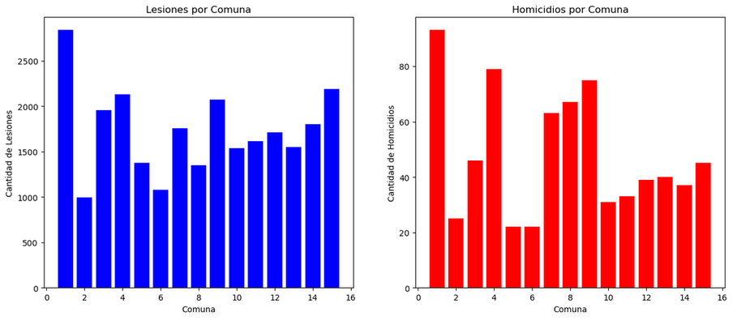
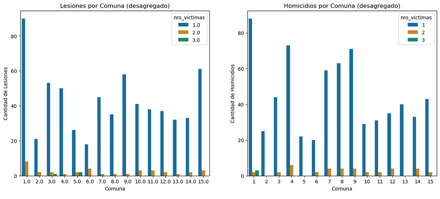

### Siniestros por año
En el análisis anual de lesiones, contamos con información correspondiente a los años 2019, 2020 y 2021. Se destaca que el año 2019 registró la mayor proporción de víctimas por lesiones en accidentes, con un 42.7%. Por otro lado, en el caso de los homicidios, disponemos de datos que abarcan desde 2016 hasta 2021, siendo el año 2018 el que presentó la tasa más alta de fatalidades por accidentes, con un 20.4%, seguido de cerca por los años 2016 (también con un 20.4%) y 2017 (con un 19.5%). En ambos conjuntos de datos, se observa que el año 2020 tuvo la menor cantidad de víctimas, lo cual podría estar relacionado con las medidas de confinamiento implementadas por el COVID 19.

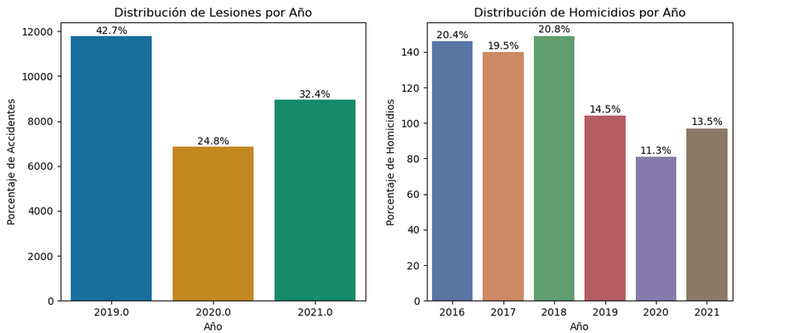

### Siniestros por tipo de calle
Tanto los accidentes mortales como los que no resultan en fatalidades ocurren principalmente en avenidas, y en menor medida, en calles. Sin embargo, cuando se examinan únicamente los siniestros mortales, las avenidas sobresalen notoriamente como el escenario más común.

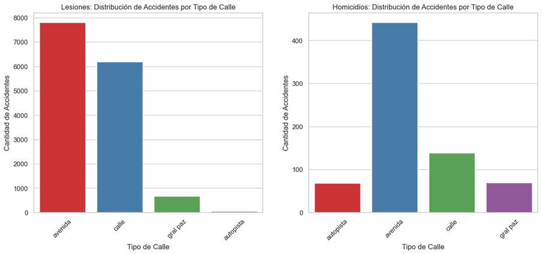

### Siniestros por franja horaria
Los dos gráficos indican que el intervalo de tiempo con la menor cantidad de lesiones debido a accidentes ocurre de la 01:00 a las 06:00 horas. Por otro lado, se observa que los accidentes mortales tienden a suceder con mayor frecuencia entre las 05:00 y las 07:00 horas de la mañana. La cantidad de lesionados por accidentes alcanza su punto máximo en el horario de 12:00 del mediodía a las 18:00 horas. Además, las 02:00 de la madrugada y las 13:00 horas son los momentos del día con la menor cantidad de muertes registradas.

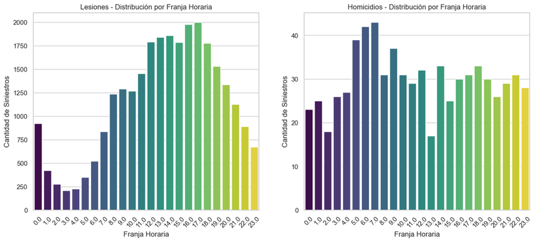

### Siniestros por sexo
En ambos casos, ya sean lesionados o víctimas mortales, el porcentaje de individuos de género masculino afectados es del **67%** y **76.6%**, respectivamente. Aunque podría interpretarse que las personas de género femenino están menos expuestas a accidentes, es importante considerar que, en Argentina, solo el **35%** de las mujeres posee licencia de conducir (1).

1. Ministerio de Transporte de Argentina. (2023). *Principales Indicadores de la Seguridad Vial con Perspectiva de Género en Argentina*. Obtenido de: https://www.argentina.gob.ar/sites/default/files/2018/12/ansv_informe-con-perspectiva-de-genero-en-argentina-marzo-2023.pdf

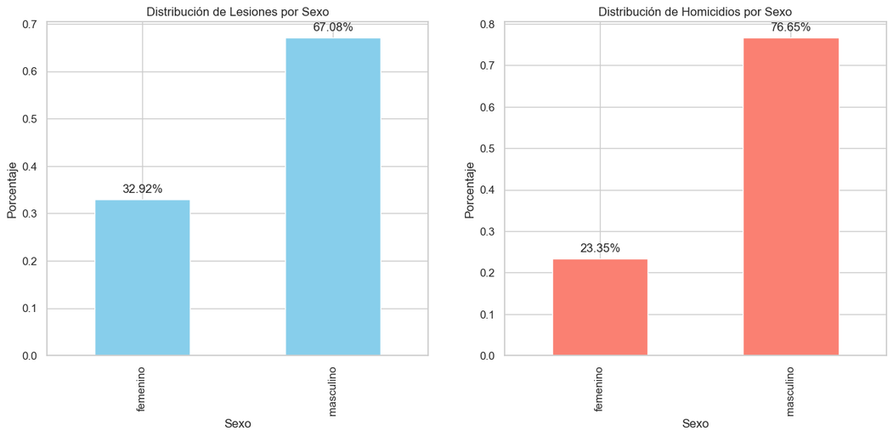

### Siniestros por edad
Los más afectados son los del rango de edades entre 20 y 40 años

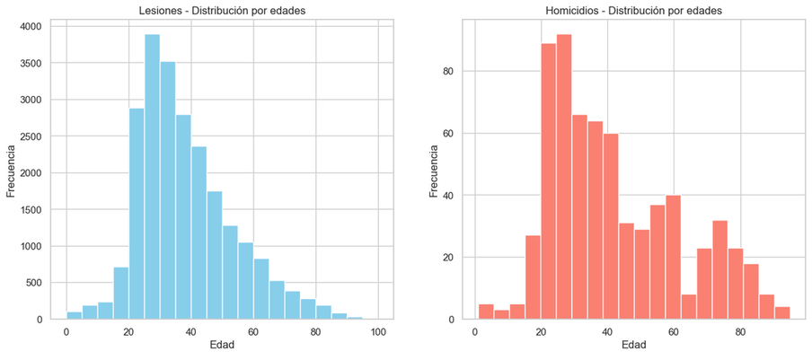

### Siniestros por mes
La mayor cantidad de lesiones suceden en los meses de octubre, marzo y diciembre, y la mayor cantidad de homicidios suceden en el mes diciembre

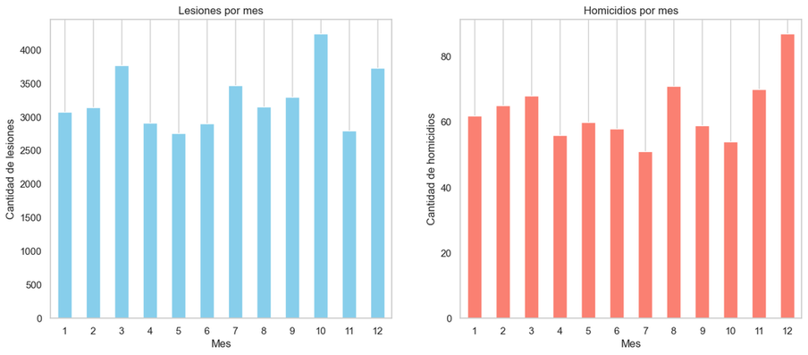

### Linea de tiempo
Se observa la drástica disminución de lesiones y homicidios en épocas de cuarentenas (2020), volviendo a subir luego de esta aunque sin regresar a niveles pre-pandemia

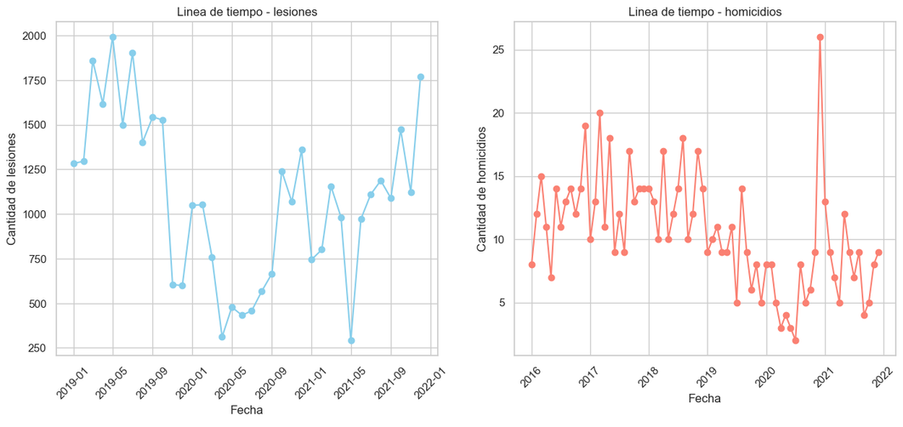

### Siniestros por tipo de vehículos (acusados o víctimas)
Se observa que 'autos', 'transporte público' y 'camionetas' son los vehiculos acusdos de provocar más lesionados, mientras que los 'autos', 'pasajeros' y 'cargas' los de mayor acusaods de homicidios.

Se observa que 'motos', 'autos', 'ciclista' y 'peatón' son los vehiculos más lesionados, de igual manera las 'motos', 'autos' y 'peatones' los de mayor homicidios.

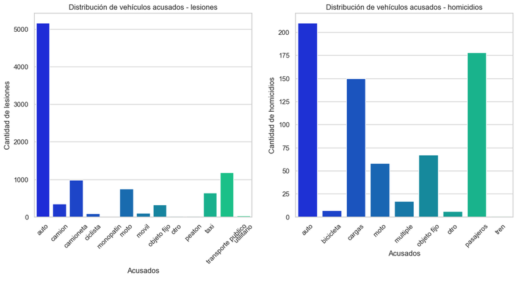
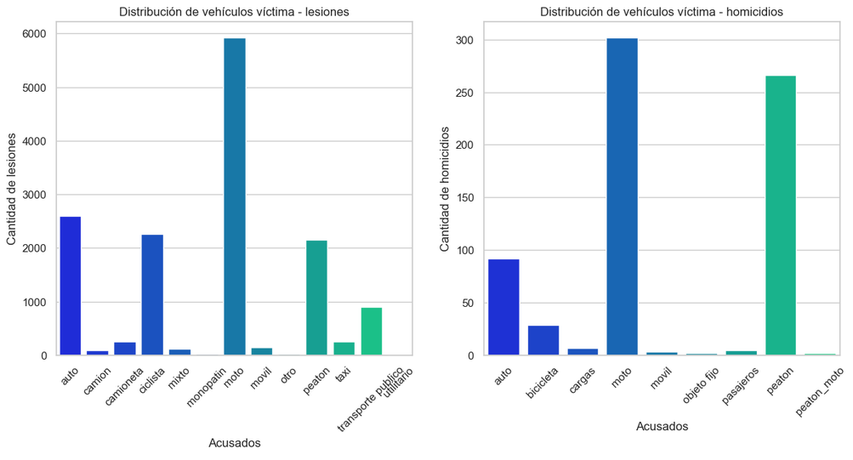

## KPIs

### 1. **Reducir en un 10% la tasa de homicidios en siniestros viales de los últimos seis meses, en CABA, en comparación con la tasa de homicidios en siniestros viales del semestre anterior**

La tasa de homicidios en accidentes de tráfico se calcula como la cantidad de muertes en dichos incidentes por cada 100,000 habitantes en una región y tiempo determinados. La ecuación utilizada es: $$\frac{\text{Número de homicidios en siniestros viales}}{\text{Población total}} \times 100,000$$

Para el **Número de Muertes en Accidentes de Tráfico**, se usa la variable 'nro_victimas' del conjunto de datos.
La **Población Total** se obtiene del **Censo 2022** proporcionado por el INDEC.

    Resumen de resultados:
    Fecha de inicio del semestre actual: 2021-06-30 00:00:00
    Fecha de inicio del semestre anterior: 2020-12-30 00:00:00
    Tasa de homicidios en siniestros viales del semestre anterior: 1.76%
    Tasa de homicidios en siniestros viales del semestre actual: 1.35%
    Reducción porcentual: 23.64%
    La reduccion de tasa de homicidios en siniestros viales respecto al semestre anterior cumple con el objetivo del 10%

### 2. Reducir en un 7% la cantidad de accidentes mortales de motociclistas en el último año, en CABA, respecto al año anterior

La cantidad de accidentes mortales de motociclistas se calcula contabilizando los siniestros fatales que involucran motociclistas en un periodo específico. La fórmula para determinar el cambio en estos accidentes es: $$\frac{(\text{Accidentes mortales con motociclistas el año pasado} - \text{Accidentes mortales con motociclistas este año})}{\text{Accidentes mortales con motociclistas el año pasado}} \times 100$$

Para **Accidentes Mortales en Moto**, se utiliza la variable 'Victima' que coincide con la categoría [moto] en el conjunto de datos.

    Resumen de resultados:
    Fecha de inicio del año actual: 2020-12-30 00:00:00
    Fecha de inicio del año anterior: 2019-12-30 00:00:00
    Cantidad de homicidios en moto en el año anterior: 28.00%
    Cantidad de homicidios en moto en el año actual: 46.00%
    Reducción porcentual: -64.29%
    La reduccion de homicidios en siniestros viales en moto respecto al año anterior no cumple con el objetivo del 7%

### 3. Tasa de mortalidad en siniestros viales en CABA sea menor a la media nacional (provincias Argentinas) en el año 2019

    Resumen de resultados:
    Performance tasa de homicidios CABA vs resto del pais: 21.55% (CABA solo representa el 21.55% de los homicidios medios del páis)
    Tasa de homicidios en siniestros viales del 2019: 2.79%

## Cómo Contribuir

1. **Análisis continuo**: Se recomienda mantener un seguimiento constante de los datos sobre homicidios en siniestros viales en la Ciudad de Buenos Aires. Esto permitirá identificar tendencias a lo largo del tiempo y evaluar la efectividad de las medidas implementadas.

2. **Enfoque en educación vial**: Se propone desarrollar iniciativas de educación vial dirigidas a toda la población. Esto podría incluir campañas de concientización sobre prácticas de conducción seguras y el fomento del respeto a las normas de tráfico.

3. **Intervenciones específicas por tipo de vehículo**: Dado que las motocicletas están frecuentemente involucradas en accidentes mortales, se sugiere implementar medidas específicas para mejorar la seguridad de los motociclistas. Esto podría incluir programas de capacitación obligatorios, controles de seguridad más estrictos y campañas de concientización.

4. **Enfoque en comuna 1**: Debido a la alta incidencia de accidentes mortales en la Comuna 1, se propone intensificar las iniciativas de seguridad vial en esta área. Esto podría incluir la implementación de medidas de control de velocidad, mejoras en la señalización y programas educativos específicos para la comunidad local.

5. **Evaluación de restricciones COVID-19**: Dado el descenso en el número de muertes anuales en 2020 debido a las restricciones de movilidad por la pandemia, sería beneficioso evaluar la posibilidad de mantener ciertas restricciones para reducir la tasa de accidentes mortales, ajustándolas según la situación actual.

6. **Refuerzo en meses de mayor riesgo**: Dado que diciembre presenta una mayor cantidad de siniestros mortales, se sugiere implementar medidas especiales de vigilancia y concientización durante este mes. Esto podría incluir campañas específicas y un aumento de patrullajes.

7. **Implementación de Estrategias en Otras áreas**: Considerando que las autopistas muestran la menor cantidad de siniestros mortales, se sugiere estudiar las estrategias de seguridad vial utilizadas en estas vías y evaluar su aplicación en otras áreas con tasas de accidentes más elevadas.

## Dashboard web

El dashboard trabajado puede ser consultado vía web sin necesidad de descargar ningún software (Power BI) a través del siguiente enlace:

<https://app.powerbi.com/view?r=eyJrIjoiMjMzZGRjNWUtNjg1NC00OGFlLTg5NDgtZDE5NTg2ZTM5ZTE5IiwidCI6IjgzZGMwYzk0LWRkNTgtNDlmNC05YmI0LTU4NDhjMWM3NmYzYyJ9>

[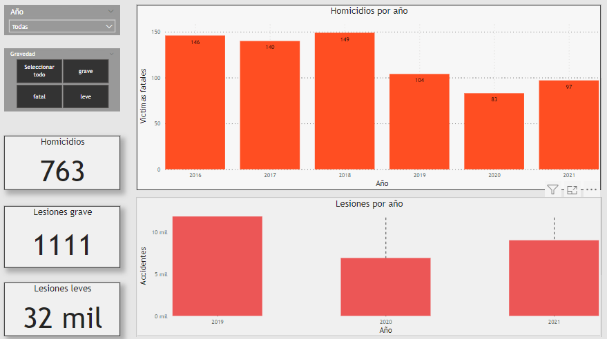](https://app.powerbi.com/view?r=eyJrIjoiMjMzZGRjNWUtNjg1NC00OGFlLTg5NDgtZDE5NTg2ZTM5ZTE5IiwidCI6IjgzZGMwYzk0LWRkNTgtNDlmNC05YmI0LTU4NDhjMWM3NmYzYyJ9)

